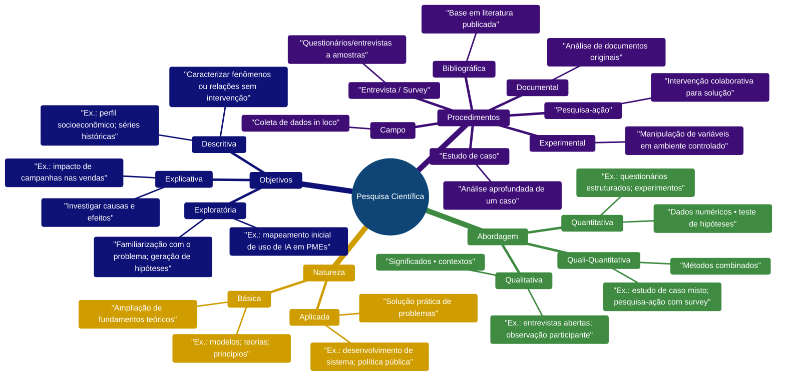

* Plano de curso - TCC1

* FACET-SNP-336 - TRABALHO DE CONCLUSÃO DE CURSO I - T01 (2026.2)

- [:game\_die: 1. Turma: TCC1 FACET-SNP-336 - TRABALHO DE CONCLUSÃO DE CURSO I - T01 (2026.2)](#game_die-1-turma-tcc1-facet-snp-336---trabalho-de-conclusão-de-curso-i---t01-20262)
  - [:watch: 1.1. Carga Horária Total: 30](#watch-11-carga-horária-total-30)
  - [:hourglass\_flowing\_sand: 1.2. Horário: 30 horas.](#hourglass_flowing_sand-12-horário-30-horas)
  - [Reuniões:](#reuniões)
  - [:page\_with\_curl: 1.3. Ementa](#page_with_curl-13-ementa)
  - [:page\_with\_curl: 1.4. Metodologia](#page_with_curl-14-metodologia)
  - [:page\_with\_curl: 1.5. Procedimentos de avaliação de aprendizagem](#page_with_curl-15-procedimentos-de-avaliação-de-aprendizagem)
  - [:hourglass\_flowing\_sand: 1.6. Horário de atendimento](#hourglass_flowing_sand-16-horário-de-atendimento)
- [:date: 2. Datas de aulas e conteúdo](#date-2-datas-de-aulas-e-conteúdo)
- [:date: 3. Datas de avaliações](#date-3-datas-de-avaliações)
- [:books: 4. Referências](#books-4-referências)
- [💾 5. Arquivos](#-5-arquivos)
  - [5.1. Templates de documentos:](#51-templates-de-documentos)
- [:alarm\_clock: 6. Professores x áreas de orientação](#alarm_clock-6-professores-x-áreas-de-orientação)
  - [🧑‍🎓 6.1. Relação Aluno x Professor x Tema:](#-61-relação-aluno-x-professor-x-tema)
- [📆 7. Calendário geral](#-7-calendário-geral)
- [📆 8. Calendário de bancas](#-8-calendário-de-bancas)
- [📺 9. Vídeos recomendados](#-9-vídeos-recomendados)
  - [📹 9.1. "Introdução" em um projeto de pesquisa](#-91-introdução-em-um-projeto-de-pesquisa)
  - [📹 9.2. "Problemática" em um projeto de pesquisa](#-92-problemática-em-um-projeto-de-pesquisa)
  - [📹 9.3. "Objetivos" em um projeto de pesquisa](#-93-objetivos-em-um-projeto-de-pesquisa)
  - [📹 9.4. "Justificativa" em um projeto de pesquisa](#-94-justificativa-em-um-projeto-de-pesquisa)
  - [📹 9.5. "Referências teórico" (ou "Revisão de literatura" ou "Trabalhos relacionados") em um projeto de pesquisa](#-95-referências-teórico-ou-revisão-de-literatura-ou-trabalhos-relacionados-em-um-projeto-de-pesquisa)
  - [📹 9.6. "Metodologia" em um projeto de pesquisa](#-96-metodologia-em-um-projeto-de-pesquisa)
  - [📹 9.7. "Procedimentos metodológicos" em um projeto de pesquisa](#-97-procedimentos-metodológicos-em-um-projeto-de-pesquisa)
  - [📹 9.8. "Cronograma" em um projeto de pesquisa](#-98-cronograma-em-um-projeto-de-pesquisa)
  - [📹 9.9. "Referências bibliográficas" em um projeto de pesquisa](#-99-referências-bibliográficas-em-um-projeto-de-pesquisa)
- [🚧 10. Estrutura do TCC1:](#-10-estrutura-do-tcc1)
- [💡 11. Tipos de pesquisa](#-11-tipos-de-pesquisa)
  - [🧠 11.1. Mapa mental](#-111-mapa-mental)
  - [🧭 11.2. Exemplos](#-112-exemplos)
  - [📌 11.2.  Resumo textual:](#-112--resumo-textual)
- [🧱 12. Ordem e janelas de entrega de documentos:](#-12-ordem-e-janelas-de-entrega-de-documentos)
- [13. Estatísticas de TCC](#13-estatísticas-de-tcc)
  - [💻 Ícones usados nesta página](#-ícones-usados-nesta-página)

---
## :game_die: 1. Turma: TCC1 FACET-SNP-336 - TRABALHO DE CONCLUSÃO DE CURSO I - T01 (2026.2)

### :watch: 1.1. Carga Horária Total: 30

### :hourglass_flowing_sand: 1.2. Horário: 30 horas.

### Reuniões: 

Na sala C7, Quarta feira: 22hs, ocorrem somente quando o coordenador de TCC realizar agendamento!

### :page_with_curl: 1.3. Ementa

Elaboração e formatação de um projeto de pesquisa ao nível de graduação.

### :page_with_curl: 1.4. Metodologia

* 1.4.1. Aulas com o professor de TCC: Aulas expositivas, dialogadas, com apresentação de conceitos teóricos/práticos. 

* 1.4.2. **Aulas com o orientador**: A metodologia será a critério do orientador/coorientador ao longo do semestre.

### :page_with_curl: 1.5. Procedimentos de avaliação de aprendizagem

Avaliação 1: Entrega do termo de aceite (do orientador e/ou coorientador).

Avaliação 2: Esta condicionada a entrega de: (a) autorização para banca com a nota do orientador + (b) 1a versão do TCC e (c) relatório de acompanhamento.

Avaliação 3: Ata de defesa inserida no documento e, este devidamente corrigido.

Os documentos devem ser enviados pelo Sigaa, será aberta na data apropriada um ítem para o upload dos documentos.

Conforme: Resolução CONEPE Nº 038/2022, páginas 18 a 19 e Resolução Nº 030/2012.

### :hourglass_flowing_sand: 1.6. Horário de atendimento

De forma online. Via agendamento prévio pelo sistema SIGAA.

---
## :date: 2. Datas de aulas e conteúdo

Aula 1: Orientação sobre o TCC (12/08/2026 - 12/08/2026) 
Aula 2: Orientações sobre o TCC (15/08/2026 - 15/08/2026) 
Aula 2: Orientações sobre o TCC 
Aula 3: Acompanhamento do trabalho aluno-orientador (19/08/2026 - 19/08/2026) 
Aula 3: Acompanhamento do trabalho aluno-orientador 
Aula 4: Avaliação 1. Entrega de termos de orientação. (22/08/2026 - 22/08/2026) 
Aula 4: Avaliação 1. Entrega de termos de orientação. 
Aula 5: Acompanhamento do trabalho aluno-orientador. (26/08/2026 - 26/08/2026) 
Aula 5: Acompanhamento do trabalho aluno-orientador. 
Aula 6: Acompanhamento do trabalho aluno-orientador. (29/08/2026 - 29/08/2026) 
Aula 6: Acompanhamento do trabalho aluno-orientador. 
Aula 7: Acompanhamento do trabalho aluno-orientador. (02/09/2026 - 02/09/2026) 
Aula 7: Acompanhamento do trabalho aluno-orientador. 
Aula 8: Acompanhamento do trabalho aluno-orientador. (05/09/2026 - 05/09/2026) 
Aula 8: Acompanhamento do trabalho aluno-orientador. 
Aula 9: Acompanhamento do trabalho aluno-orientador. (09/09/2026 - 09/09/2026) 
Aula 9: Acompanhamento do trabalho aluno-orientador. 
Aula 10: Acompanhamento do trabalho aluno-orientador. (12/09/2026 - 12/09/2026) 
Aula 10: Acompanhamento do trabalho aluno-orientador. 
Aula 11: Acompanhamento do trabalho aluno-orientador. (16/09/2026 - 16/09/2026) 
Aula 11: Acompanhamento do trabalho aluno-orientador. 
Aula 12: Avaliação 2. Entrega de documentos/projeto. (19/09/2026 - 19/09/2026) 
Aula 12: Avaliação 2. Entrega de documentos/projeto. 
Aula 13: Acompanhamento do trabalho aluno-orientador. (23/09/2026 - 23/09/2026) 
Aula 13: Acompanhamento do trabalho aluno-orientador. 
Aula 14: Acompanhamento do trabalho aluno-orientador. Bancas. (26/09/2026 - 26/09/2026) 
Aula 14: Acompanhamento do trabalho aluno-orientador. Bancas. 
Aula 15: Avaliação 3, entrega de versão final do trabalho. (30/09/2026 - 30/09/2026) 
Aula 15: Avaliação 3, entrega de versão final do trabalho. 

## :date: 3. Datas de avaliações

* Avaliação 1: / /2026
* Avaliação 2: / /2026
* Avaliação 3: / /2026

---
## :books: 4. Referências

* MONTEIRO, Emiliano Soares. Projeto de sistemas e bancos de dados. Rio de Janeiro: Brasport, 2004. 321. ISBN: 8574521760.

* LAKATOS, Eva Maria; MARCONI, Marina de Andrade. Fundamentos de metodologia científica. 5. ed. São Paulo: Atlas, 2003.

[Referências bibliográficas nas bibliotecas virtuais](https://docs.google.com/presentation/d/1mKl1KTREAIjZhxWLcdsbQxzeVbAWtvCqdxAxfi3oeBc/view).

* Atualização da norma ABNT para projeto de TCC: https://bibliotecas.ufu.br/acontece/2025/01/atualizacao-da-norma-de-apresentacao-de-trabalhos-academicos-abnt-nbr-14724
e
https://www.instagram.com/p/DEmwHkLtmfs/?img_index=4
e
https://www.instagram.com/p/DEpsW-PhgFo/?img_index=6

* ABNT NBR 14724 Quarta edição 16.12.2024
  
---
## 💾 5. Arquivos

### 5.1. Templates de documentos:

Links para os documentos de TCC1:

1. No link tree do curso: https://linktr.ee/si.unemat
ou
2. No Sigaa (na disciplina de TCC).
ou
3. No repositório da disciplina: https://github.com/monteiro74/aulas_2025_2/tree/main/tcc1

4. O template de projeto do TCC 1 no Overleaf: https://www.overleaf.com/read/nbdjpvwkjdjy#44d1b3

---
## :alarm_clock: 6. Professores x áreas de orientação

**! Em breve atualizaremos as áreas dos professores e suas áreas de orientação**.  
No momento os professores que temos no curso são:

| Nº | Professor Orientador | Área/tema de interesse em orientar |
|---:|---|---|
| 1 | Benevid Felix | Tecnologias emergentes em inteligência artificial |
| 2 | Donizete Ritter | 1. Matemática discreta;   2. Teoria dos números;   3. Análise combinatória;   4. Lógica;    5. Matemática comercial e financeira;   6. Álgebra linear;   7. Problemas de otimização usando programação linear;   8. Problemas de otimização usando programação não-linear;   9. Problemas de otimização usando programação inteira;   10. Metaheurísticas;   11. Estudo envolvendo algumas redes neurais;   12. Utilização da linguagem de programação AMPL em problemas de otimização;   13. Linguagem de programação LOGO (Superlogo);   14. Códigos corretores de erros;   15. Uso dos softwares de Otimização LINGO e OTIMIZA. |
| 3 | Elias Morgan | 1. Computação Tecnológica.   2. Gestão da Tecnologia da Informação, Administração em TI.   3. Sistemas de Informação Gerenciais, Sustentáveis.   4. Gestão de Serviços, Projetos, Empreendedorismo em TI.   5. Sistemas Integrados de Gestão (ERP).   6. Planejamento Estratégico de TI.   7. Inteligência Artificial: Analítica, Quântica, Computacional e Explicável.   8. Sistemas Inteligência.   9. Tecnologias Emergentes em SI.   10. Negócios Digitais.   11. Sistemas Distribuídos e Cloud Computing.   12. Automação Digital.   13. Governança de TI.   14. Gestão da Inovação Tecnológica.   15. Ética, Privacidade e Legislação em TI.   16. Comportamento Organizacional para TI.   17. Segurança da Informação.   18. Auditoria de TI. |
| 4 | Elisange Brugnera | 1. Tecnologias assistiva;   2. Tecnologias na educação;   3. IHC |
| 5 | Emiliano Soares Monteiro | 1. IoT, tratamento de dados via ETL e dashboards.   2. Blockchain privadas.   3. Desenvolvimento de sistemas de gestão empresariais (ERP, BI, CRM, etc.).   4. Operações de ETL e dashboards de BI.   5. Desenvolvimento mobile;   6. Desenvolvimento de sistemas para desktop;   7. Sistemas para rastreabilidade e logística;   8. Sistemas para gestão de fazendas.   |
| 6 | Francisco Sanches | 1. Arquiteturas de Big Data (Data Lakes, Lakehouses).   2. Pipelines de dados (ETL/ELT) otimizados e automatizados.   3. Visualização de dados e análise exploratória em larga escala.   4. Escalabilidade, resiliência e consistência em sistemas distribuídos.   5. Computação em Nuvem (Cloud), de Borda (Edge) e Névoa (Fog).   6. Protocolos de comunicação e otimização de desempenho em redes.   7. Bancos de dados distribuídos (NoSQL, NewSQL).   8. Modelos de programação paralela (MPI, OpenMP, CUDA).   9. Projeto e análise de algoritmos paralelos. Virtualização de recursos de HPC.   10. Ecossistema Apache Hadoop/Yarn.   11. IA |
| 7 | Ivan Pires | Sistemas Web |
| 8 | Janecler Foppa | 1. Tópicos Especiais em Computação aplicada;   2. Interação Homem Computador;   3. Gestão de Tecnologia da Informação |
| 9 | João Ricardo dos Santos Rosa | 1. Acessibilidade.   2. Usabilidade.   3. UX.   4. Engenharia de software.   5. Engenharia de requisitos.   6. Design ou prototipação.   7. Interação humano-computador |
| 10 | Juliano Fernandes de Ávila |  TICs, Educação e Tecnologia Inovação na Prática Educacional |
| 11 | Maicon Sartin | 1. IA. Aprendizado de Máquina e Profundo.   2. Visão Computacional.   3. Tecnologias e Sistemas Inteligentes na Educação.   4. Automação com Microcontroladores (Arduino) e Sistemas Embarcados (Raspberry).   5. IoT e Redes de Sensores sem Fio.   6. Estações Meteorológicas: Análise de dados, análise de sensores, Comunicação, Predição, Acessibilidade em Websites, etc. |
| 12 | Mauro Júnior | 1. Inovação/Startups (desenvolvimento de produtos/serviços);   2. Empreendedorismo (desenvolvimento de novos negócios);   3. Experiência de usuário (metodologias de UX/UI) |
| 13 | Ramilton Costa Gomes Junior | 1. Banco de dados.   2. Segurança.   3. Computação forense.   4. IA.   5. Visão computacional. |
| 14 | Tales Nereu Bogoni | Empreendedorismo, desenvolvimento e análise de sistemas gerenciais |

.

### 🧑‍🎓 6.1. Relação Aluno x Professor x Tema:

| Id | Aluno                                | Professor | Tema | 1ª Entrega | 2ª Entrega | 3ª Entrega |
| -- | ------------------------------------ | --------- | ---- | ---------- | ---------- | ---------- |
| 1  | ALLAN CRISTIAN KRAUSE                |           |      |            |            |            |
| 2  | ANDRE FERREIRA HASHIMOTO             |           |      |            |            |            |
| 3  | ANNA CAROLINA NICACIO NEVES          |Maicon     |      |            |            |            |
| 4  | ANTÔNIO JÚNIOR MARTINS DA SILVA      |           |      |            |            |            |
| 5  | CAIO FELIPE GOMES LOPES              |           |      |            |            |            |
| 6  | CARLOS EDUARDO SPAK JUNCHER          |Ramilton    |      |            |            |            |
| 7  | DANIELE SENKO DE LIMA                |           |      |            |            |            |
| 8  | DAVID COSTA DE ARAÚJO                |Francisco  |      |            |            |            |
| 9  | DENIS MATEUS BRITOS LOPES            |Benevid    |      |            |            |            |
| 10 | DYENIFER SILVA CUNHA                 |Francisco  |      |            |            |            |
| 11 | EDUARDO DAMIAN BIZIO                 |           |      |            |            |            |
| 12 | ERIK ROBERTO DE SOUZA MORAIS         |           |      |            |            |            |
| 13 | FELLIPE MELHORANCA BICALHO TOMASELLA |Benevid    |      |            |            |            |
| 14 | FRANCISCO DE JULIO FARIA             |Maicon     |      |            |            |            |
| 15 | GABRIEL BEREGULA GOMES               |Maicon     |      |            |            |            |
| 16 | GISELLI SATIKO TOYOMOTO FUJIMORI     |Ivan+Emiliano|      |            |            |            |
| 17 | INGLID PABLINA DE ALMEIDA SANDESKI   |Ramilton   |      |            |            |            |
| 18 | JOÃO ANTÔNIO BITTENCOURT MONTAGNER   |João Ricardo |      |            |            |            |
| 19 | JOÃO PAULO CAVALCANTE ZANATTA        |           |      |            |            |            |
| 20 | JOÃO PEDRO BORGES DIAS               |           |      |            |            |            |
| 21 | JOÃO VITOR DE SOUZA COSTA            |           |      |            |            |            |
| 22 | JOÃO VITOR TRAVASSO                  |Janecler   |      |            |            |            |
| 23 | JULIO CESAR COLLI                    |           |      |            |            |            |
| 24 | KAROLAINE PONCI DOS SANTOS           |Ramilton   |      |            |            |            |
| 25 | LANA EMANUELE DE SOUZA MORAES        |Francisco  |      |            |            |            |
| 26 | LUCAS BUTASKOSKI                     |           |      |            |            |            |
| 27 | LUIZ HENRIQUE MOTA XAVIER            |Janecler   |      |            |            |            |
| 28 | MARCOS VINICIUS CARVALHO SCALCON     |           |      |            |            |            |
| 29 | NICOLAS FELIPE HASSELSTROM DA VEIGA  |Maicon     |      |            |            |            |
| 30 | PAULO HENRIQUE ANDRADE GERALDI       |           |      |            |            |            |
| 31 | PEDRO HENRIQUE FIGUEIREDO            |           |      |            |            |            |
| 32 | PEDRO HENRIQUE FREITAS SILVA         |           |      |            |            |            |
| 33 | RENATO ARAUJO DA SILVA               |           |      |            |            |            |
| 34 | ROBERTO VINICIUS DE MORAIS ALCÂNTARA |           |      |            |            |            |
| 35 | THAMARA ANSELMO DOS SANTOS           |Ramilton   |      |            |            |            |
| 36 | VITOR FORTUNATO DE OLIVEIRA          |           |      |            |            |            |
| 37 | VITOR LINSBINSKI DE OLIVEIRA         | Ivan Pires|      |            |            |            |

Total de alunos matriculados: . 
Total de entregas na 3a etapa: . 

---
## 📆 7. Calendário geral

---
## 📆 8. Calendário de bancas

[Calendário de bancas]()

---
## 📺 9. Vídeos recomendados

### 📹 9.1. "Introdução" em um projeto de pesquisa

[Como escrever a INTRODUÇÃO de um PROJETO DE PESQUISA??](https://www.youtube.com/watch?v=mVNGp3h9-2Y)

[Como escrever uma introdução? (Projeto de pesquisa) | Iniciação Científica](https://www.youtube.com/watch?v=x1tWKdZkfc0)

[Como escrever uma INTRODUÇÃO – Exemplo no WORD para PROJETO DE PESQUISA, ARTIGO CIENTÍFICO e TCC](https://www.youtube.com/watch?v=wQbZCKcg9BY)

### 📹 9.2. "Problemática" em um projeto de pesquisa

[Problema de pesquisa - como definir](https://www.youtube.com/watch?v=hCg8qfqXQOM)

[Problema de pesquisa: Como definir? - Pesquisa na prática 163](https://www.youtube.com/watch?v=KTLd8M5gLZ8)

[TCC: O que é e Como fazer o seu Problema de Pesquisa](https://www.youtube.com/watch?v=amTtrerAKvc)

### 📹 9.3. "Objetivos" em um projeto de pesquisa

[Objetivos de pesquisa: geral e específicos.] https://www.youtube.com/watch?v=disr6-Cof3M

[Quais são os objetivos do seu projeto de pesquisa] https://www.youtube.com/watch?v=UY9LrgrsqjM

[Objetivo Geral e Objetivos Específicos - Técnica passo a passo! | André Fontenelle](https://www.youtube.com/watch?v=MhUzhXRm-Io)

### 📹 9.4. "Justificativa" em um projeto de pesquisa

[COMO REALIZAR A JUSTIFICATIVA DE UMA PESQUISA CIENTÍFICA](https://www.youtube.com/watch?v=FYykgc0OnKw)

[TCC: Justificativa do jeito certo](https://www.youtube.com/watch?v=oD1Q-bkEY5o)

[Justificativa de TCC - Tire todas as suas dúvidas! | André Fontenelle](https://www.youtube.com/watch?v=lU90DQHRLKg)

[JUSTIFICATIVA DE TCC E PROJETO DE PESQUISA: o que é e como fazer / Com exemplos](https://www.youtube.com/watch?v=cnYBb1IwBgo)

### 📹 9.5. "Referências teórico" (ou "Revisão de literatura" ou "Trabalhos relacionados") em um projeto de pesquisa

[Referencial Teórico: Como organizar e escrever? | Para dissertação, tese ou projeto de pesquisa](https://www.youtube.com/watch?v=joLnfx8nwSc)

[REFERÊNCIAL TEÓRICO NO PROJETO DE PESQUISA | Como escrever, o que escrever](https://www.youtube.com/watch?v=DXfJRtMB_SA)

[#4 - FUNDAMENTAÇÃO TEÓRICA - ELABORAÇÃO DE PROJETO DE PESQUISA](https://www.youtube.com/watch?v=WMgbYdqvelY)

[FUNDAMENTAÇÃO TEÓRICA para TCC, Projeto de Pesquisa e Artigos: Exemplo Passo a Passo](https://www.youtube.com/watch?v=tjppG26WOK0)

### 📹 9.6. "Metodologia" em um projeto de pesquisa

[METODOLOGIA DO PROJETO DE PESQUISA | O que escrever, como escrever?](https://www.youtube.com/watch?v=xh-5SyaOTnY)

[Metodologia Científica do seu TCC - Em 5 passos simples](https://www.youtube.com/watch?v=fVmmPZsmtbE)

[PROJETO DE PESQUISA - MÉTODO](https://www.youtube.com/watch?v=QlWYzUSUO64)

### 📹 9.7. "Procedimentos metodológicos" em um projeto de pesquisa

[COMO ESCREVER A METODOLOGIA DO PROJETO DE PESQUISA | Daniel Mendes](https://www.youtube.com/watch?v=HhuTYwsC3bc)

[Projeto de pesquisa | Procedimentos metodológicos.](https://www.youtube.com/watch?v=XfXGyypexN0)

### 📹 9.8. "Cronograma" em um projeto de pesquisa

[Orientações sobre o CRONOGRAMA do projeto de pesquisa](https://www.youtube.com/watch?v=uv5Hpu6gaew)

[Como elaborar um cronograma para o pré-projeto de pesquisa?](https://www.youtube.com/watch?v=E3lp-S8LOOc)

### 📹 9.9. "Referências bibliográficas" em um projeto de pesquisa

[Como buscar referências para o TCC de revisão bibliográfica?](https://www.youtube.com/watch?v=XJqqffY4dS8)

[Projeto de Pesquisa - Referências Bibliográficas](https://www.youtube.com/watch?v=jgTWsJGpi-8)

[PROJETO DE PESQUISA - CONCLUSÃO E REFERÊNCIAS](https://www.youtube.com/watch?v=_Nfq-n2m2vA)

[CITAÇÃO E REFERÊNCIA - TCC, MESTRADO E DOUTORADO](https://www.youtube.com/watch?v=RpriX_2uGSo)

[COMO FAZER AS REFERÊNCIAS ABNT! FÁCIL E RÁPIDO! 2025!](https://www.youtube.com/watch?v=43m777TUcEg)

---
## 🚧 10. Estrutura do TCC1:

Fonte da figura: https://www.pucminas.br/biblioteca/DocumentoBiblioteca/ABNT-Elaborar-formatar-projeto-de-pesquisa.pdf, página 7.

---
## 💡 11. Tipos de pesquisa

| Dimensão / Tipo                      | Descrição                                                                                  | Exemplos                                                |
| ------------------------------------ | ------------------------------------------------------------------------------------------ | ------------------------------------------------------- |
| **Abordagem – Quantitativa**         | Analisa dados numéricos para medir e testar hipóteses, buscando resultados mensuráveis.    | Questionários estruturados, experimentos laboratoriais. |
| **Abordagem – Qualitativa**          | Interpreta fenômenos por meio de dados não numéricos, explorando significados e contextos. | Entrevistas abertas, observação participante.           |
| **Abordagem – Qualiquantitativa**    | Integra métodos quantitativos e qualitativos para maior profundidade e amplitude.          | Estudos de caso com estatísticas e relatos.             |
| **Natureza – Aplicada**              | Produz conhecimento voltado à solução prática de problemas específicos.                    | Desenvolvimento de tecnologia, políticas públicas.      |
| **Natureza – Básica**                | Gera conhecimento teórico sem aplicação imediata, focando fundamentos.                     | Teorias matemáticas, estudos sobre comportamento.       |
| **Objetivo – Exploratória**          | Ganha familiaridade com o problema e formula hipóteses.                                    | Levantamento sobre uso de IA em empresas.               |
| **Objetivo – Descritiva**            | Descreve características ou relações sem manipular variáveis.                              | Perfil socioeconômico de uma população.                 |
| **Objetivo – Explicativa**           | Investiga causas e efeitos de fenômenos.                                                   | Impacto da publicidade nas vendas.                      |
| **Procedimento – Experimental**      | Manipula variáveis em ambiente controlado para verificar efeitos.                          | Teste de medicamentos, usabilidade de software.         |
| **Procedimento – Bibliográfica**     | Usa material já publicado como base teórica.                                               | Revisão de literatura sobre blockchain.                 |
| **Procedimento – Documental**        | Analisa documentos originais sem tratamento prévio.                                        | Registros contábeis, atas de reuniões.                  |
| **Procedimento – Campo**             | Coleta dados diretamente no local do fenômeno.                                             | Observação em supermercados, dados climáticos.          |
| **Procedimento – Pesquisa-Ação**     | Pesquisador e participantes atuam juntos para resolver problemas.                          | Melhoria de processos produtivos.                       |
| **Procedimento – Estudo de Caso**    | Análise profunda de um ou poucos objetos.                                                  | Gestão de inovação em uma startup.                      |
| **Procedimento – Entrevista/Survey** | Questionários ou entrevistas para coletar percepções e opiniões.                           | Pesquisa de satisfação de clientes.                     |

### 🧠 11.1. Mapa mental

### 🧭 11.2. Exemplos

Exemplo de situação para classificar a pesquisa:

O aluno de um curso de TI irá: "*desenvolver um sistema novo para uma empresa na qual ele trabalha, irá integrar dados de fontes diversas, converter dados, terá uma versão responsiva e mobile, irá entrevistar os usuários e mensurar a velocidade de resposta do sistema.*".

A classificação da pesquisa será:

| Dimensão / Tipo | Justificativa no contexto do projeto |
|-----------------|--------------------------------------|
| **Abordagem – Quali-Quantitativa** | O aluno vai coletar **dados qualitativos** (entrevistas com usuários) para entender necessidades e percepções, e também **dados quantitativos** (medição da velocidade de resposta do sistema) para mensurar desempenho. |
| **Natureza – Aplicada** | O desenvolvimento do sistema visa resolver um **problema real e específico** da empresa onde ele trabalha, com aplicação prática imediata. |
| **Objetivo – Explicativa** | Além de criar o sistema, ele **avaliará fatores que influenciam o desempenho** (como tempo de resposta), o que envolve investigar relações de causa e efeito. Também há traços de **descritiva** (caracterizar necessidades dos usuários), mas o foco principal é **explicar** o comportamento e desempenho. |
| **Procedimentos – Pesquisa-Ação + Experimental + Estudo de Caso** | **Pesquisa-Ação** porque ele participa ativamente da implementação junto aos usuários. **Experimental** porque vai mensurar e testar desempenho com variáveis controladas (ex.: antes e depois de otimizações). **Estudo de Caso** porque o trabalho é focado em uma única empresa. Também haverá **Pesquisa de Campo** (entrevistas presenciais) e **Documental** (integração e análise de dados de diversas fontes). |

### 📌 11.2.  Resumo textual:
O projeto é uma pesquisa quali-quantitativa, de natureza aplicada, com objetivo explicativo, conduzida por meio de pesquisa-ação, experimentos e estudo de caso, complementada por entrevistas e análise documental.

---
## 🧱 12. Ordem e janelas de entrega de documentos:

Ordem e janelas de entrega de documentos:

1ª entrega, será em início de final de agosto/início de setembro:
Doc1a_Termo_Aceite_e_Compromisso_Orientador_v2.docx  (estes termos devem estar assinados pelo orientador)
Doc1b_Termo_Aceite_e_Compromisso_Coorientador_v2.docx  <<-- Se houver coorientador !

2ª entrega, será no início de novembro:
Um dos relatórios abaixo (escolha um formato)                                                                                                        
Doc2_Relatorio_de_Acompanhamento_de_projeto_modelo1_v2.docx                                                                                                     
Doc2_Relatorio_de_Acompanhamento_de_projeto_modelo2_v2.docx                                                                                                     
+
Doc3_Autorizacao_para_apresentacao_projeto_v3.docx                                                                                                              
+
o documento que você vai mandar para banca ler !

3ª entrega, será no fim de novembro:
Template Projeto TCC1 v3.docx  (corrigido)
e
[ATA_TCC_1.docx](https://docs.google.com/document/d/18j2q4C7jAOYfiOTf92ZuVOoZ_CBQLiTm/edit?tab=t.0)

---
## 13. Estatísticas de TCC

---
### 💻 [Ícones usados nesta página](https://github.com/ikatyang/emoji-cheat-sheet)

